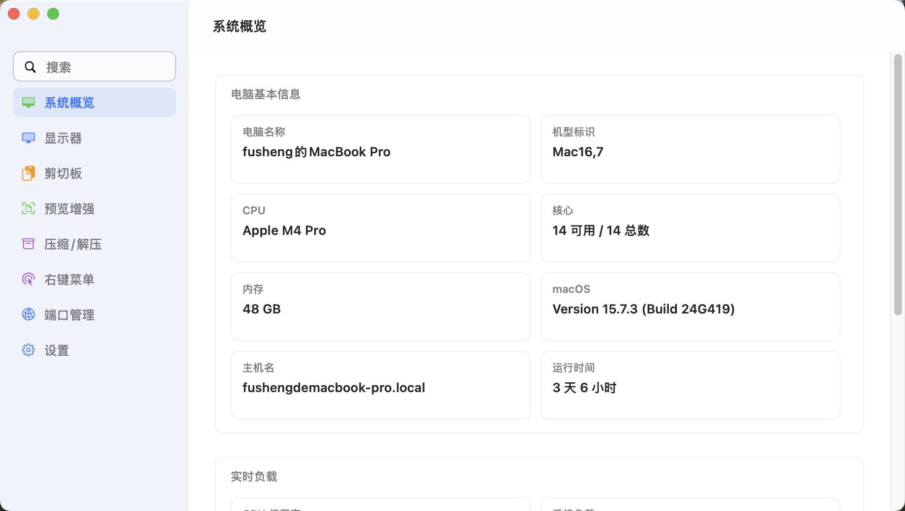
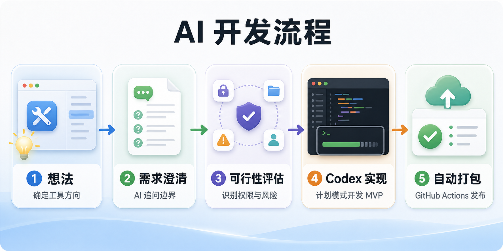
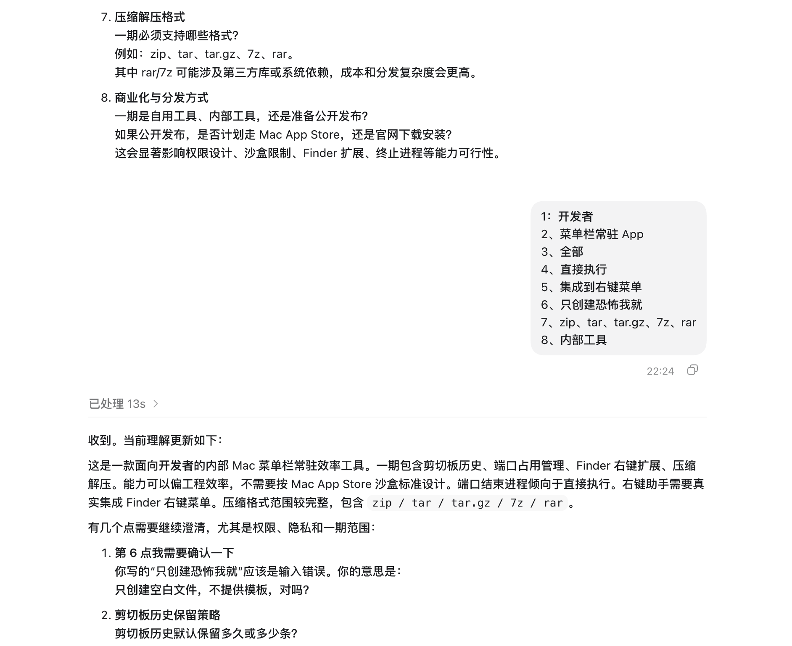
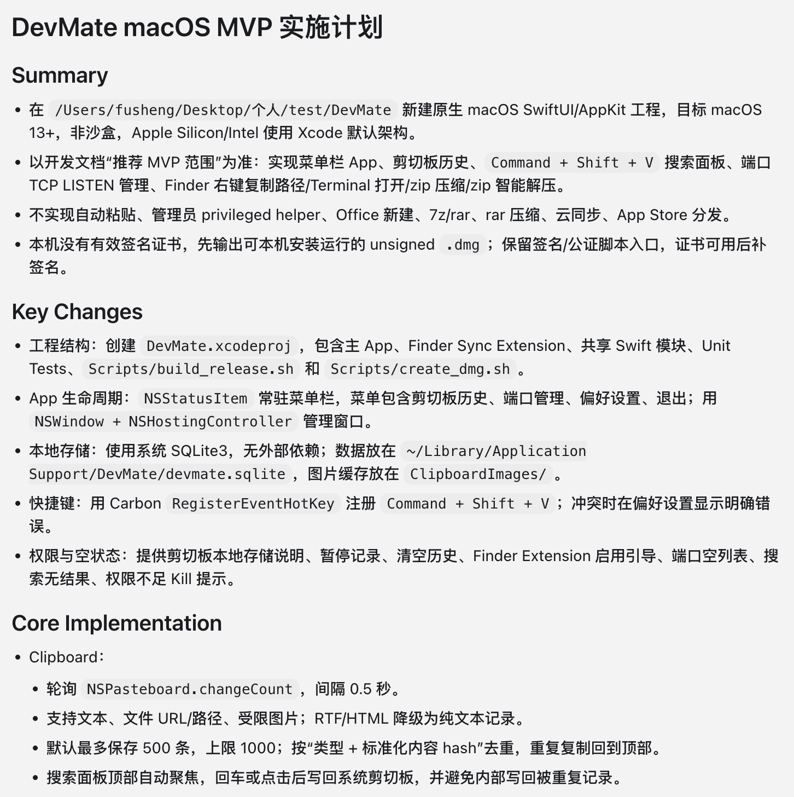

# 我是怎么用 AI 开发一个 macOS 工具项目的

项目叫 `mac-tool`，它把 **显示屏管理工具 + 压缩包工具 + 右键菜单增强工具 + 端口占用管理工具 + 剪切板工具** 合在了一款 macOS 菜单栏软件里。

主要功能包括：

- 剪切板预览：记录复制历史，支持搜索、收藏、快捷粘贴，并适配 macOS 的空格预览习惯；
- 压缩与智能解压：支持创建多种格式的压缩包和解压，智能识别压缩包结构，单文件直接释放，多文件散落时自动解压到同名目录；
- Finder 右键菜单：在 Finder 里新建常用文件、复制路径、用终端或编辑器打开目录，并直接压缩/解压；
- 显示屏自由控制：管理外接显示器，支持软断开/恢复、切换分辨率，调节亮度、对比度和音量；
- 端口管理：查看端口占用、进程信息，并支持释放端口；
- 配置与权限：支持配置导入导出、iCloud 备份和系统权限诊断。

仓库地址：[https://github.com/fusheng8/mac-tool](https://github.com/fusheng8/mac-tool)



这篇文章不展开讲功能细节，重点讲这个项目是怎么用 AI 从一个想法一步步做出来的。

先说明一下背景：我是一个后端开发，本身没有 macOS 应用开发基础，对 Swift、SwiftUI、AppKit 这些也不是日常工作内容。这个项目从需求梳理、技术方案、代码实现到 GitHub 自动打包，基本都是全程借助 AI 完成的。

整个过程不是简单地说一句“帮我写个 App”，然后等 AI 一次性生成代码。我的做法是把 AI 放到不同阶段里，让它分别承担产品经理、架构师、开发者和自动化助手的角色。

整体流程大概是这样：

1. 先让 AI 当产品经理，帮我澄清需求；
2. 再让 AI 当架构师，评估技术可行性；
3. 然后让 AI 输出开发文档；
4. 最后用 Codex 按开发文档直接实现 MVP；
5. 初版完成后，再让 AI 接手 GitHub 自动打包。

下面按实际开发顺序展开。



## 1. 先别写代码，让 AI 当产品经理

一开始我只有一个大概想法：做一个 Mac 系统功能增强工具，补齐一些日常高频操作短板。

一期想做的功能包括：

- 剪切板历史；
- 端口占用管理；
- 右键助手；
- 压缩与智能解压。

这个时候我没有让 AI 直接写代码，而是先让它扮演产品经理，主动向我提问，帮我把需求问清楚。



我给它的提示词核心是：

```markdown
你是一名资深产品经理，擅长将初步想法拆解为清晰、可落地的产品需求文档。

接下来我会描述一个产品想法。请你不要直接写 PRD，而是先主动向我提问，帮助澄清产品定位、目标用户、使用场景、功能边界、优先级、交互方式、系统限制和一期版本范围。

每一轮优先提出最重要的 5-8 个问题，根据我的回答继续追问。信息足够后，再输出一份可用于研发评审的 PRD。
```

这个阶段很关键。因为很多需求刚开始看起来很简单，但细问之后会发现有很多边界问题。

比如剪切板历史，是只保存文本，还是也保存图片和文件？端口管理里结束进程要不要二次确认？右键助手到底是做 Finder 扩展，还是通过应用内能力配合系统服务实现？智能解压遇到同名文件、加密压缩包、损坏压缩包怎么处理？

这些问题如果不提前想清楚，后面写代码时一定会反复返工。

这一轮结束后，AI 给了我一份 PRD。到这里，项目才从“一个想法”变成了“一个可以开发的需求”。

## 2. 拿 PRD 做技术可行性评估

有了 PRD 之后，我没有马上开写，而是新开了一个对话，让 AI 换成 macOS 应用架构师和 Swift 开发者的角色。

这一步我让它完整阅读 PRD，然后逐条评估：

- 需求是否合理；
- 技术是否可行；
- 是否适合 macOS 原生应用实现；
- 是否涉及系统权限、沙盒限制或审核风险；
- 有没有降级方案；
- 如果可行，推荐怎么开发。

提示词里我特别强调了一点：不要默认所有需求都可行。

```markdown
你是一名资深 macOS 应用架构师和 Swift 开发者，熟悉 SwiftUI、AppKit、macOS 权限体系、沙盒限制、系统 API、菜单栏应用、后台任务和 App Store 审核要求。

请先完整阅读 PRD，不要编码。本轮只做可行性评估和开发方案设计。

逐条拆解 PRD 中的子需求，判断合理性、可行性、权限风险、沙盒风险、审核风险和降级方案。

最终输出：总体结论、子需求可行性评估表、高风险需求说明、可行需求开发方案、推荐 MVP 范围、开发里程碑、待确认问题。
```

这里我还特意让它使用子代理并行调研。

原因很简单：如果所有调研都放在主代理里做，会慢，而且会占掉大量上下文。子代理只需要给结论，不需要把完整过程都塞回主对话。主代理负责汇总结果就行。

我让子代理按这几个方向拆：

- macOS / Swift 技术可行性；
- 权限、沙盒与 App Store 审核；
- 产品与需求合理性；
- 工程实现方案。

这轮评估结果比较理想：核心功能整体都可行，只是部分能力需要注意权限、交互确认和实现边界。

既然没有发现必须推翻的高风险需求，我就继续让 AI 基于评估结果输出具体开发文档。

## 3. 用开发文档驱动 Codex 直接实现

拿到开发文档后，我又新开了一个对话。这次目标很明确：不要再讨论需求，不要再写方案，直接开发 MVP。

这里我用的是 Codex 的计划模式。先让它列计划，再执行计划。



我的提示词核心是：

```markdown
你是一名资深 macOS 应用开发者，熟悉 Swift、SwiftUI、AppKit 和 macOS 应用开发流程。

请以开发文档为唯一需求依据，直接开始开发 MVP 版本。

本轮任务不是需求评估，不是编写开发文档，也不是讨论技术方案，而是基于已有开发文档直接实现功能。

请完成：
- 阅读开发文档；
- 检查当前项目结构和已有代码；
- 确认 MVP 范围；
- 实现核心功能；
- 补充必要的错误处理、空状态和权限提示；
- 运行构建或测试；
- 如果失败，分析并修复；
- 最终说明完成内容和验证结果。
```

我还加了一些限制：

- 不重新设计项目结构；
- 不修改开发文档；
- 不删除用户已有文件；
- 不重构无关代码；
- 不引入不必要的第三方依赖；
- 不停留在方案阶段；
- 除非遇到核心阻塞，否则不要停下来问我。

这些限制很有用。因为 AI 有时会习惯性回到“分析问题、给出建议”的状态，但这个阶段我需要的是它像开发者一样推进代码。

计划模式的好处是节奏比较稳：先读文档，再读代码，再拆任务，然后实现、构建、修复。中间如果构建失败，也能沿着计划继续定位。

到这一步，初版程序就完成了。

回头看，真正有效的地方不是“让 AI 一步到位”，而是每一步都让它扮演合适的角色：

- 产品阶段，它负责帮我把需求问清楚；
- 技术阶段，它负责识别风险和边界；
- 方案阶段，它负责把需求转成开发文档；
- 编码阶段，它负责读代码、改代码、跑构建、修问题。

我负责的是判断方向、确认取舍、控制范围。

## 4. 后期：让 AI 接手 GitHub 自动打包

初版程序完成后，我开始考虑自动打包。

一开始我问 AI：有什么办法可以自动化控制 GitHub 仓库？它给了两个方向：GitHub MCP 和 GitHub CLI。

最后我选择了 GitHub CLI，也就是 `gh`。

原因很简单：`gh` 是 GitHub 官方命令行工具，成熟、稳定、资料多。并且我是 Mac，直接用 Homebrew 一行命令就装好了。

接下来我直接让 Codex 使用 `gh` 去完成后续事情：

- 创建 GitHub 云端仓库；
- 关联本地仓库和远程仓库；
- 推送代码；
- 配置 GitHub Actions；
- 调试云端构建流程；
- 查看构建日志；
- 根据报错继续修改配置。

这一步很适合交给 AI。GitHub Actions 的调试经常是一些琐碎问题，比如路径不对、构建命令不对、产物上传配置不对。Codex 可以自己看日志、改配置、再触发构建，很快就把流程跑通了。


到这里，这个项目不只是本地能跑，也有了基本的云端自动打包能力。

## 我的体会

这次最大的体会是：用 AI 开发项目，不要把它只当“代码生成器”。

更高效的方式是分阶段使用它：

- 想不清楚需求时，让它当产品经理；
- 不确定能不能做时，让它当架构师；
- 要落地时，让它写开发文档；
- 真正开发时，让它按计划改代码；
- 做工程化时，让它操作 CLI 和 CI 工具链。

AI 很适合处理信息密集、步骤明确、反馈闭环清晰的工作。但方向判断、产品取舍、范围控制，还是要人来做。

我的感觉是：AI 不是替代开发者，而是把一个人的开发流程放大了。只要把阶段拆清楚、角色设清楚、输入给清楚，它确实可以把一个项目从想法一路推进到可运行、可构建、可发布。
