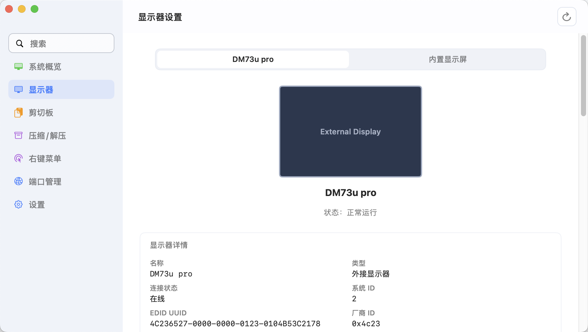
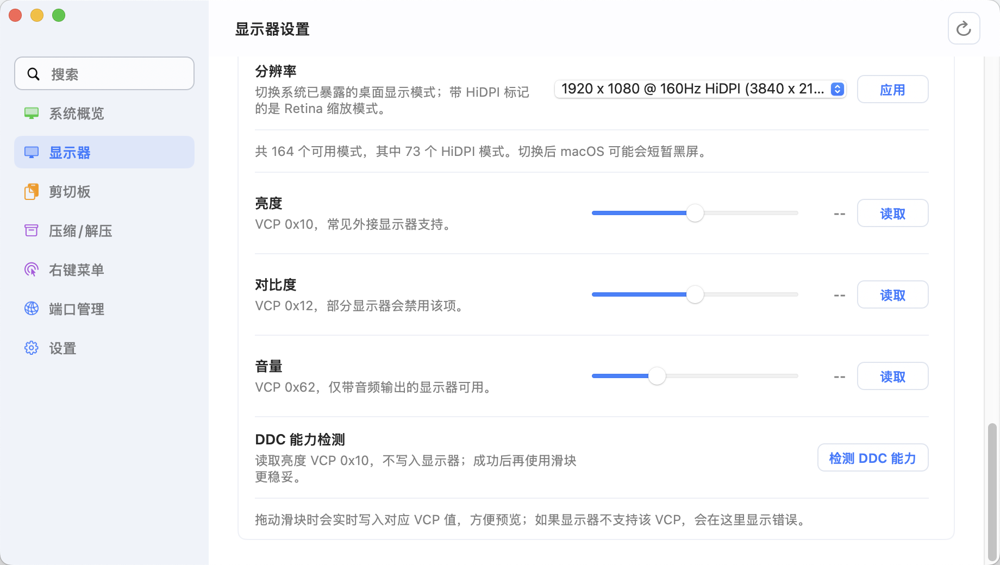
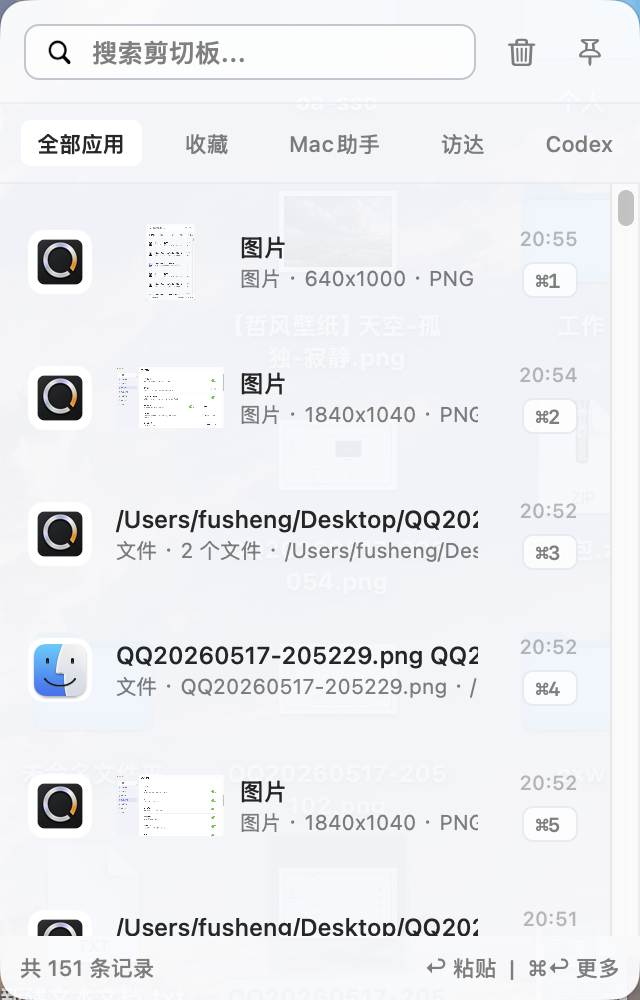
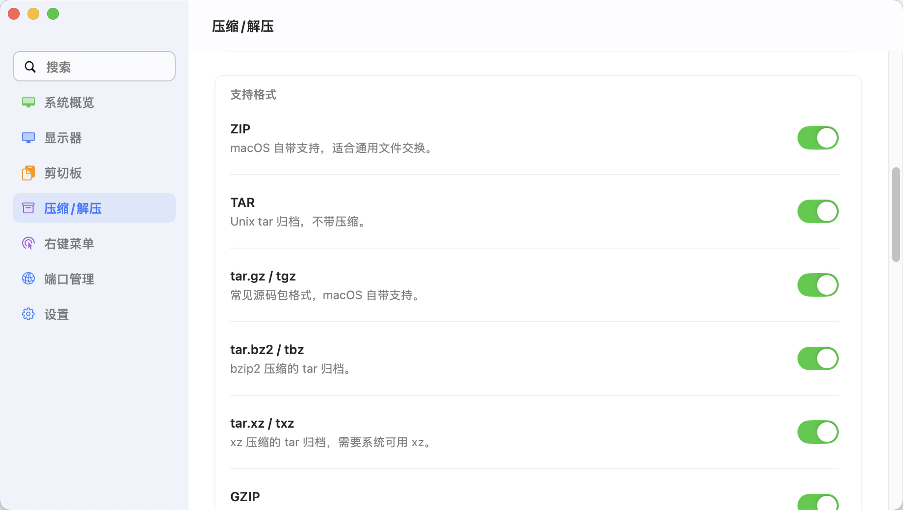
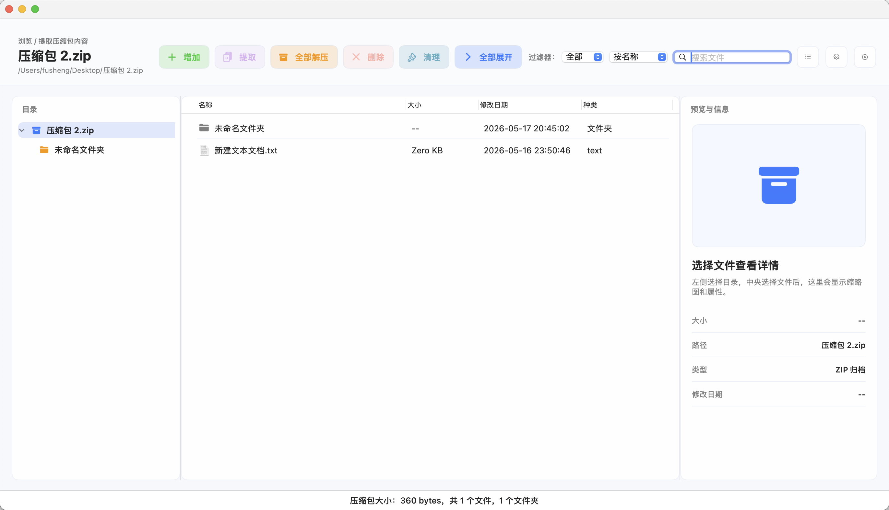
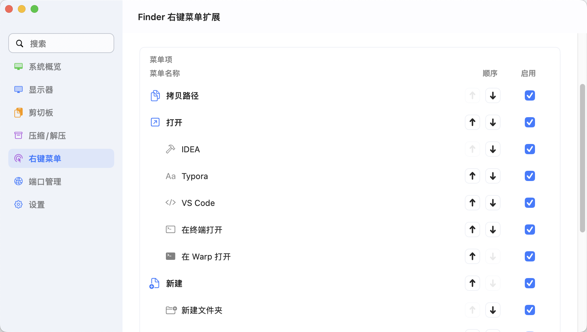
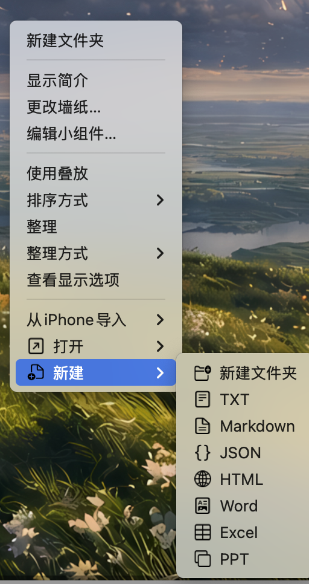
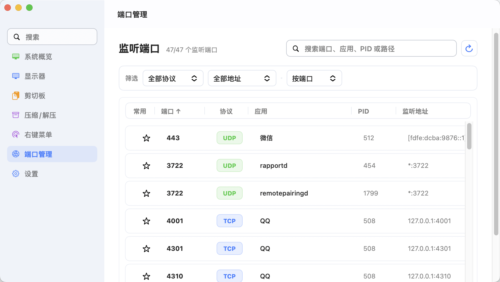

# Mac助手

Mac助手是一款面向 macOS 的轻量菜单栏效率工具。它把外接显示器控制、剪贴板历史、Finder 右键增强、压缩/解压和端口占用查看放在一个本机 App 里，适合经常连接外接显示器、处理压缩包、排查本地服务端口的 Mac 用户。

当前稳定版本为 `0.2.6`，仅支持 Apple Silicon（arm64）和 macOS 13 Ventura 或更高版本。隐私、故障恢复和兼容性说明分别见 [PRIVACY.md](PRIVACY.md)、[docs/recovery.md](docs/recovery.md) 与 [docs/compatibility.md](docs/compatibility.md)。

底层项目名和主可执行文件名为 `mac-tool`，App 展示名为 `Mac助手`。

## 适合场景

- 经常连接外接显示器，需要统一查看显示器身份、切换分辨率、调节亮度/对比度/音量或临时断开外屏。
- 日常复制内容较多，需要可搜索、可收藏、可快捷粘贴的本地剪贴板历史。
- 频繁处理压缩包，希望在 Finder 右键菜单中完成智能解压、自定义压缩和格式转换。
- 本地开发时经常遇到端口占用，需要快速定位监听端口、应用、PID、监听地址和进程详情。
- 希望把零散的 macOS 小工具收进一个菜单栏应用，并保留可导入导出的本地配置。

## 功能亮点

- **一站式 macOS 工具集合**：把 Finder 右键菜单扩展、显示器管理、压缩/解压、剪贴板历史和端口管理集合到一个轻量菜单栏 App 中。
- **智能解压**：自动识别压缩包内部结构，单文件或已有顶层目录时直接释放，多文件散落时解压到同名文件夹，减少手动整理。
- **剪贴板预览**：剪贴板历史面板适配 macOS 空格预览习惯，图片、文本和文件记录可快速预览后再粘贴。
- **显示器关闭与恢复保护**：支持外接显示器软断开、断开前确认、自动恢复倒计时和安全兜底，尽量避免把所有屏幕关闭。
- **显示器管理**：扫描当前显示器，按 EDID UUID、厂商 ID、型号 ID、序列号、显示器名称、I/O 位置等稳定特征匹配设备。
- **外接显示器 DDC/CI 控制**：基于 `m1ddc` 思路整理的 DDC 后端，支持亮度、对比度、音量等常见 VCP 码读写。
- **分辨率与 HiDPI 切换**：枚举系统已暴露的显示模式，并在设置页中切换分辨率。
- **剪贴板历史**：后台记录剪贴板，支持全局快捷键呼出、搜索、按应用筛选、格式粘贴、纯文本粘贴、快捷键导航和密码管理器排除。
- **Finder 右键菜单增强**：通过 Finder Sync 扩展提供复制路径、新建文件、一键用 IntelliJ IDEA 或 VS Code 打开指定目录、终端打开、压缩和解压等动作。
- **压缩包预览与操作**：支持查看压缩包内容、部分提取、删除条目、压缩为多种格式，并可自动去除 `.DS_Store` 等 macOS 元数据。
- **端口管理**：查看当前监听端口、协议、应用、PID、监听地址和应用路径，支持搜索、筛选、排序、收藏常用端口和停止占用进程。
- **权限诊断**：内置辅助功能、自动化、Finder 扩展、完全磁盘访问等权限引导与诊断信息复制。
- **配置导入导出与 iCloud 备份**：显示器、剪贴板、压缩/解压和右键菜单配置都可以导出为 JSON，也可以备份到 iCloud Drive。

## 功能地图

| 模块 | 主要入口 | 解决的问题 |
| --- | --- | --- |
| 菜单栏 | 状态栏图标 | 快速进入所有功能，查看运行状态，切换登录启动 |
| 显示器 | 设置窗口 > 显示器 | 识别外接显示器、切换分辨率、执行 DDC/CI 控制、软断开与恢复 |
| 剪贴板 | 全局快捷键 / 设置窗口 > 剪贴板 | 搜索历史复制内容，按应用过滤，空格预览，按格式或纯文本快速粘贴 |
| 压缩/解压 | Finder 右键菜单 / 压缩包双击 / 设置窗口 | 智能解压、自定义压缩、压缩包预览、去除 macOS 元数据 |
| 右键菜单 | Finder Sync 扩展 | 在 Finder 中新建文件、复制路径，一键调用 IDEA、VS Code 或终端打开指定目录，压缩和解压 |
| 端口管理 | 设置窗口 > 端口管理 | 查找端口占用，筛选监听地址，查看进程详情，释放端口 |
| 配置与权限 | 设置窗口 > 设置 | 导入导出配置、iCloud 备份、打开系统权限页、复制诊断信息 |

## 软件功能详解

### 菜单栏入口

Mac助手默认作为菜单栏应用运行，不占用 Dock 位置。状态栏图标用于快速查看当前工作状态，并打开常用模块：

- 打开剪贴板历史面板。
- 进入显示器、剪贴板、压缩/解压、右键菜单、端口管理和设置页。
- 开启或关闭登录启动。
- 根据剪贴板记录数量、右键菜单状态、待恢复显示器数量生成状态提示。

### 显示器管理

显示器页围绕外接显示器的识别、控制和恢复设计，适合多屏办公或经常插拔显示器的场景：





- 扫描当前在线显示器，并展示显示器名称、EDID UUID、厂商 ID、型号 ID、序列号、厂商、I/O 位置、是否内置屏、是否活跃等信息。
- 使用稳定身份匹配显示器，优先匹配 EDID UUID，也支持厂商/型号/序列号、字母数字序列号、I/O 位置和显示器名称。
- 支持严格匹配和加权匹配，便于应对显示器、扩展坞或系统更新导致的标识变化。
- 支持枚举系统暴露的分辨率和 HiDPI 模式，并在切换后进行确认；如果用户没有确认，会恢复到切换前模式。
- 支持复制当前显示器详情，便于反馈兼容性问题。

### 外接显示器 DDC/CI 控制

DDC 控制用于直接向外接显示器写入 VCP 指令，当前提供常见快捷项：

| 控制项 | VCP 码 | 说明 |
| --- | --- | --- |
| 亮度 | `0x10` | 常见外接显示器支持 |
| 对比度 | `0x12` | 部分显示器会禁用 |
| 音量 | `0x62` | 仅带音频输出的显示器可用 |

使用方式：

- 先执行“DDC 能力检测”，读取亮度 VCP `0x10`，确认链路可用。
- 每个快捷项都可以单独读取当前值，也可以通过滑块写入目标值。
- 写入操作带有节流，避免拖动滑块时过度发送 DDC 指令。
- 内置屏、虚拟屏或缺少 EDID 的显示器会禁用 DDC 控制。

### 显示器软断开与自动恢复

软断开功能用于临时关闭外接显示器，但会尽量保证不会把用户置于无可用屏幕的状态：

- 关闭显示器前进行安全检查，阻止关闭内置屏、阻止关闭最后一块可用屏幕。
- 可开启关闭前二次确认，减少误触导致的短暂黑屏。
- 可开启自动恢复，并配置恢复倒计时。
- 应用启动、系统唤醒或显示器变化时，会根据配置检查并恢复期望状态。
- 保存最近见过的显示器信息，用于恢复时定位目标显示器。

### 剪贴板历史

剪贴板历史用于记录日常复制内容，并提供快速检索和粘贴能力：




- 后台轮询剪贴板变化，支持配置监听间隔。
- 支持全局快捷键呼出，默认快捷键为 `Shift + Command + V`。
- 支持启用、暂停记录、最多保留条数、按天自动清理。
- 支持收藏记录，收藏记录不会被按天自动清理。
- 支持搜索剪贴板内容，并按来源应用筛选。
- 适配 macOS 的空格预览习惯，选中图片、文本或文件记录后可用空格键快速预览内容。
- 支持默认按格式粘贴，也支持纯文本粘贴。
- 支持面板内快捷键：选择上一条/下一条、切换应用筛选、粘贴选中项、纯文本粘贴、快速预览、打开更多菜单、快速粘贴可见项。
- 默认排除常见密码管理器，例如 1Password、Bitwarden、KeePassXC，避免记录敏感内容。
- 支持自定义排除 App Bundle ID；对浏览器隐私窗口无法稳定识别时，建议排除整个浏览器。

### 压缩与解压

压缩/解压模块既可以通过设置页配置，也可以通过 Finder 右键菜单和压缩包默认打开方式使用：



- 智能解压会读取压缩包内容：如果压缩包内只有单文件或已有顶层目录，会尽量直接释放；否则解压到同名文件夹，避免污染当前目录。
- 支持解压到当前目录、解压到压缩包名称、解压后删除源压缩包等动作。
- 支持自定义压缩，可选择格式、压缩等级、输出文件名和密码。
- 支持压缩时跳过 `.DS_Store`、`__MACOSX`、AppleDouble 等常见 macOS 元数据。
- 支持解压完成后自动关闭进度弹窗。
- 可注册为压缩包默认打开方式，双击压缩包后打开内置浏览器。

支持格式：

| 格式 | 能力说明 |
| --- | --- |
| ZIP | 内置归档引擎支持 ZIP64、传统加密和 AES 加密包 |
| TAR | 内置归档引擎支持 Unix tar 归档 |
| tar.gz / tgz | 内置归档引擎支持常见源码包格式 |
| tar.bz2 / tbz | bzip2 压缩的 tar 归档 |
| tar.xz / txz | xz 压缩的 tar 归档 |
| GZIP | 单文件 gzip 压缩 |
| BZIP2 | 单文件 bzip2 压缩 |
| XZ | 单文件 xz 压缩 |
| 7Z | 内置归档引擎支持读取、解压和密码压缩 |
| RAR | 内置归档引擎支持读取/解压；创建 RAR 需要额外安装 `rar` |

### 压缩包预览

当 Mac助手作为默认压缩包打开方式时，可以直接预览压缩包内容：



- 展示目录树、文件列表、文件大小、修改时间和路径。
- 支持搜索、展开/折叠目录、紧凑/舒展列表切换。
- 支持图片和文本预览；无法预览的文件可临时解压后用系统默认应用打开。
- 支持选择部分文件或文件夹提取到指定位置。
- 支持从部分格式中删除条目，修改前会二次确认。
- 加密压缩包会在读取、预览或解压时提示输入密码。

### Finder 右键菜单

Finder Sync 扩展会在 Finder 空白处或选中文件时提供增强菜单。菜单项可在设置中开关：





- 新建文件夹。
- 拷贝文件或目录路径。
- 打开文件或目录。
- 一键调用 IntelliJ IDEA、VS Code 打开当前目录或选中的目录，适合从 Finder 直接进入项目开发。
- 使用 Typora 打开 Markdown 文档或目录。
- 在系统终端或 Warp 中打开目录。
- 新建 TXT、Markdown、JSON、HTML、Word、Excel、PowerPoint 文件。
- 压缩/解压子菜单：自定义压缩、智能解压、解压到当前目录、解压到压缩包名称、压缩为 ZIP/TAR/tar.gz/tar.bz2/tar.xz/GZIP/BZIP2/XZ/7Z/RAR。

Finder 右键菜单依赖 Finder Sync 扩展。首次安装或更换 Bundle ID 后，可能需要在系统设置中重新启用扩展并重启 Finder。

### 端口管理

端口管理用于定位本机正在监听的端口，适合开发者排查端口占用：



- 展示端口、协议、应用、PID、监听地址和应用路径。
- 支持按端口、应用、PID、路径搜索。
- 支持按 TCP/UDP 和本机/局域网地址筛选。
- 支持按端口、应用、PID、协议、监听地址、路径排序。
- 支持收藏常用端口，常用端口会优先展示。
- 双击端口可查看进程详情，包括 CPU、内存、虚拟内存、线程数、打开文件数、父进程、运行状态、运行时长和命令行。
- 支持复制停止命令，也支持通过界面选择停止方式释放端口。

停止进程前会弹出确认框，并显示目标 PID、端口和监听地址。`kill` 类停止方式可能导致目标应用丢失未保存状态，请谨慎使用。

### 配置、备份与权限

设置页集中处理应用配置和系统授权：


- 导出当前配置为 JSON，或从 JSON 导入恢复。
- 手动备份配置到 iCloud Drive，或从 iCloud 备份同步到本机。
- 打开辅助功能、自动化、Finder 扩展、完全磁盘访问等系统设置页。
- 提供授权引导浮窗，方便把当前 App 拖入系统权限列表。
- 提供 Finder 扩展测试入口，打开下载目录后可直接验证右键菜单是否出现。
- 一键复制或导出本地诊断文件，方便定位权限、显示器、配置和日志问题。

## 系统要求

- macOS 13 Ventura 或更高版本。
- Apple Silicon（arm64）；0.2.6 不提供 Intel 构建。
- Swift 6 toolchain / Xcode 16 或更高版本。
- 非沙盒运行环境。项目使用显示相关私有符号和 Finder Sync 扩展，不适合上架 Mac App Store。
- DDC/CI 功能依赖显示器、连接线和 macOS 当前暴露的底层能力；部分显示器可能不支持亮度、对比度或音量 VCP 码。
- App 内置固定版本的 7-Zip 控制台引擎，ZIP、TAR、GZIP、BZIP2、XZ、7Z 和 RAR 读取/解压不依赖 Homebrew；只有创建或修改 RAR 需要额外安装 `rar`。
- 内置 7-Zip 依据 LGPL 及 unRAR 限制分发，许可证随 App 位于 `Contents/Resources/ThirdPartyLicenses/7-Zip.txt`。
- 受 macOS 版 7-Zip 控制台限制，压缩密码目前仅支持 ASCII 字符；中文文件名不受影响。

## 快速开始

正式构建要求固定的 Apple Development 或 Developer ID Application 签名身份：

```bash
CODESIGN_IDENTITY="Apple Development: Your Name (TEAMID)" scripts/build_app.sh
```

`build_app.sh` 只生成 App：

```text
.build/Mac助手.app
```

安装到默认的 `~/Applications`，或显式安装到系统目录：

```bash
scripts/install_app.sh
scripts/install_app.sh /Applications
```

没有证书时，只有开发验证可显式使用 `ALLOW_ADHOC=1 scripts/build_app.sh`。

打包 DMG：

```bash
scripts/build_dmg.sh
```

需要生成可提交 Apple 公证的本地 DMG 时，先把公证凭据保存到钥匙串，再启用公证开关：

```bash
xcrun notarytool store-credentials mac-tool-notary
CODESIGN_IDENTITY="Developer ID Application: Your Name (TEAMID)" \
  NOTARIZE=1 NOTARYTOOL_PROFILE=mac-tool-notary \
  scripts/build_dmg.sh
```

该流程会等待 `notarytool` 返回结果，并执行 `stapler` 与 Gatekeeper 验证。`NOTARIZE=1` 不接受 Apple Development 或 ad-hoc 签名。

生成位置类似：

```text
.build/Mac助手-0.2.6.dmg
```

版本号只从仓库根目录的 `VERSION` 读取，构建号取 Git 提交计数。DMG 始终包含指向 `/Applications` 的安装入口。发布工作流只响应与 `VERSION` 一致的版本标签或手动触发；PR 与 `main` 使用只读 CI 验证。

### 在线更新

Mac助手使用 Sparkle 2 检查并安装后续更新。更新包仍通过 GitHub Release 分发，Sparkle appcast 通过 GitHub Pages 暴露：

```text
https://fusheng8.github.io/mac-tool/appcast.xml
```

0.2.6 自动发布仍使用固定 Apple Development 身份和 Hardened Runtime；本地构建脚本已支持 Developer ID Application 与 Apple 公证，但不会自动改变 GitHub Release 门槛。安装后的版本更新由 Sparkle 使用 EdDSA 签名校验。发布前需要把本机导出的 Sparkle 私钥配置到仓库 Secret：

```text
SPARKLE_PRIVATE_KEY
```

私钥本地文件默认放在已忽略的 `private/sparkle_private_key`，不要提交到仓库。GitHub Pages 需要在仓库设置中启用，并选择 GitHub Actions 作为 Pages 来源。

正式构建不会回退到 ad-hoc 签名；本地可选择 Apple Development 或 Developer ID Application：

```bash
security find-identity -v -p codesigning
CODESIGN_IDENTITY="Apple Development: Your Name (TEAMID)" scripts/build_app.sh
CODESIGN_IDENTITY="Developer ID Application: Your Name (TEAMID)" scripts/build_app.sh
```

推荐让 Apple 代码签名私钥始终留在本机钥匙串：先在本机生成正式签名 DMG，再把它上传到对应版本的草稿 Release：

```bash
CODESIGN_IDENTITY="Apple Development: Your Name (TEAMID)" \
  DMG_NAME=MacTool.dmg scripts/build_dmg.sh
gh release create 0.2.6 .build/MacTool.dmg \
  --title 0.2.6 --generate-notes --verify-tag --draft
```

版本标签触发后，GitHub Actions 会下载该预签名 DMG，重新验证磁盘镜像、arm64 架构、固定 Team Identifier、Hardened Runtime、Bundle/扩展签名、版本和路径，再使用仓库中已有的 `SPARKLE_PRIVATE_KEY` 生成 appcast。验证完成前 Release 保持草稿状态。

如果既没有受控 Actions 签名 keychain，也没有对应标签的预签名草稿 DMG，发布工作流会直接失败，且不会回退到 ad-hoc。

## 开发

使用 Swift Package Manager 构建：

```bash
swift build
```

在 Xcode 中运行：

```bash
open Package.swift
```

然后选择 `mac-tool` scheme，运行目标选择普通的 `My Mac`。不要选择 `Mac Catalyst`、`DriverKit`、`Designed for iPad/iPhone` 或 iOS Simulator。

如果 Xcode 提示找不到 `AppKit`、`ServiceManagement` 或 `ApplicationServices`，通常是运行目标没有选到普通 macOS。切回 `My Mac` 后执行 `Product > Clean Build Folder`。

## 权限配置

Mac助手会按功能需要引导你开启以下权限：

| 权限 | 影响功能 |
| --- | --- |
| 辅助功能 | 剪贴板双击粘贴、快捷键粘贴、自动向当前应用发送粘贴快捷键 |
| 自动化 | Finder 或系统应用联动动作，macOS 会按目标应用逐项确认 |
| Finder 扩展 | Finder 右键菜单、压缩/解压、复制路径、新建文件等入口 |
| 完全磁盘访问 | 更顺畅地处理桌面、文稿、下载、外置磁盘中的压缩包 |

如果反复重建 App 后系统重复弹出辅助功能授权，建议：

1. 退出 Mac助手。
2. 打开“系统设置 > 隐私与安全性 > 辅助功能”。
3. 删除 Xcode、`.build` 或旧安装路径下的临时授权条目。
4. 重新运行 `scripts/build_app.sh`，只保留并勾选 `~/Applications/Mac助手.app`。

Finder 右键菜单未出现时，可以先确认系统设置中已启用 “Mac助手右键菜单” 扩展，再执行：

```bash
killall Finder
```

## 数据位置

运行数据保存在当前用户目录下：

| 内容 | 路径 |
| --- | --- |
| 主配置 | `~/Library/Application Support/mac-tool/config.json` |
| 运行状态 | `~/Library/Application Support/mac-tool/state.json` |
| 剪贴板加密库 | `~/Library/Application Support/mac-tool/Clipboard/clipboard-v2.sqlite` |
| 剪贴板密文 blob | `~/Library/Application Support/mac-tool/Clipboard/encrypted-blobs/` |
| 剪贴板密文缩略图 | `~/Library/Application Support/mac-tool/Clipboard/encrypted-thumbnails/` |
| 剪贴板密钥 | 登录钥匙串，`ThisDeviceOnly`，不会导出或同步 |
| 日志 | `~/Library/Logs/mac-tool/app.log` |
| Finder Sync 配置副本 | `~/Library/Containers/com.fusheng.mac-tool.FinderSyncExtension/Data/Library/Application Support/mac-tool/config.json` |
| Finder 桥接密钥 | Finder 扩展容器中的 `bridge.key`，不会导出或备份 |
| iCloud 配置备份 | `~/Library/Mobile Documents/com~apple~CloudDocs/Mac助手/config-backup.json` |

## 项目结构

```text
Sources/
  DDCBackend/                  Objective-C DDC/CI 与显示器底层桥接
  MacToolCore/                 Swift 6 安全策略、加密原语、端口与归档规则
  MacToolBridge/               App 与 Finder 扩展共享的签名请求模型
  MacToolApp/                   主 AppKit 菜单栏应用
  MacToolFinderSync/            Finder Sync 右键菜单扩展
Resources/                      App 图标与状态栏图标
scripts/
  build_app.sh                  构建并签名本地 App
  install_app.sh                安装已构建 App，默认到 ~/Applications
  build_dmg.sh                  构建 DMG
  finder_sync_extension.entitlements
Licenses/
  m1ddc-MIT-LICENSE             DDC 后端相关来源许可证
```

## 已知限制

- DDC 和软断开能力依赖 macOS 私有显示相关符号，系统版本变化可能影响可用性。
- 外接显示器控制结果取决于显示器固件、连接方式、扩展坞和线材。
- Finder Sync 扩展受 macOS 权限、系统缓存和 Finder 状态影响，首次安装后可能需要重启 Finder 或重新启用扩展。
- 剪贴板历史、元数据、blob 和缩略图均使用本机钥匙串密钥加密；如果你会复制敏感内容，仍建议开启密码管理器排除、暂停记录或定期清理历史。

## 开源项目参考与使用

本项目的实现、运行时能力和测试数据参考或使用了以下开源项目：

| 项目 | 在本项目中的用途 |
| --- | --- |
| [m1ddc](https://github.com/waydabber/m1ddc) | DDC/CI 显示器控制后端参考了其实现思路，相关 MIT 许可证见 [Licenses/m1ddc-MIT-LICENSE](Licenses/m1ddc-MIT-LICENSE)。 |
| [Mole CLI](https://github.com/tw93/mole) | 应用卸载、残留文件扫描、路径保护和安全删除等能力参考了其设计思路。 |
| [GRDB.swift](https://github.com/groue/GRDB.swift) | 作为 SwiftPM 依赖，用于剪贴板历史的 SQLite 数据存储。 |
| [Sparkle](https://github.com/sparkle-project/Sparkle) | 作为 SwiftPM 依赖，用于检查、验证和安装应用更新。 |
| [7-Zip](https://github.com/ip7z/7zip) | 随 App 分发固定版本的 `7zz` 控制台引擎，用于压缩包读取、创建、解压和修改。 |
| [libarchive](https://github.com/libarchive/libarchive) | RAR 兼容性测试中的历史样本来源。 |

## 友情链接

- [LINUX DO - 新的理想型社区](https://linux.do/)

## 许可证

项目整体使用 [Unlicense](LICENSE) 发布，意图是不对复制、修改、发布、使用、编译、销售或分发施加版权限制。

DDC 后端包含基于 `m1ddc` 思路整理的实现，相关 MIT 许可证见 [Licenses/m1ddc-MIT-LICENSE](Licenses/m1ddc-MIT-LICENSE)。
